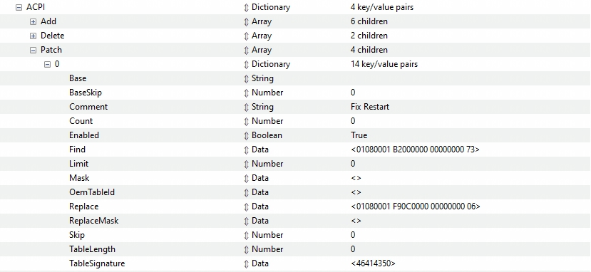

# Dell OptiPlex3080 MFF Hackintosh
 
个人在用黑苹果小主机，买回来之后装了 Monterey 用过一段时间，后来升级 Venture 时没有完全搞懂导致引导不了了，重装系统也不能解决，就换回 Windows 在用。最近又来了冲动，在网上看了些相关的介绍，又莫名其妙的可以用了。

这个机器在印象中所有的介绍都提到要解锁 CFG，之前时没有搞定的，这次折腾后差不多理解了，通过一个牛人的 [EFI](https://github.com/hackintosh-club/dell-optiplex-3080-mff) 里带的工具 [CFGLock](https://github.com/hackintosh-club/dell-optiplex-3080-mff/blob/master/EFI/OC/Tools/CFGLock.efi) 解锁了。但是呢，他的EFI 在我的电脑上用不了，没找到是什么原因，怀疑是BIOS 版本不同的问题？我的BIOS版本是2.20.0，看他的描述是2.16.0。不想手动改BIOS的话用他这里的工具还是很方便的。

目前系统升级到了Sequoia，还在日常使用看有什么问题再说。

EFI 源自 [PCBETA](https://bbs.pcbeta.com/viewthread-1937259-1-1.html)，通过 OCAT 将 OC 升级到了目前的最新版本 1.0.2，Kext 也进行了相应的升级（不然的话无法引导 Sequoia，可以引导Catalina）。在原 EFI 的基础上我禁掉了 NVMeFix.kext，不然的话会在引导阶段卡住。Kexts 升级后貌似很突然的解决了一个睡眠（sleep）唤醒后显示器无信号的情况（必须插拔显示器线才能恢复正常显示）。

关于之前一直纠结的重启问题也找到了解决方法，同样来自于上面待CFGLock 工具的EFI里，在ACPI -> 下增加一项即可。

基于目前的配置，短时间内看睡眠可以通过鼠标和键盘唤醒（之前用的时候时不行的，必须要把休眠关掉）。接下来的计划：

* USB 端口定制
* 增加 Intel Wi-Fi（自带的，在BIOS里现禁用掉了）

## BIOS 设置

|Settings|Value|
|----|---|
|System Configuration → Integrated NIC | Enabled |
|System Configuration → SATA Operation | AHCI |
|Security → PTT Security/PTT On | Disabled |
|Secure Boot → Secure Boot Enable | Disabled |
|Secure Boot → Secure Boot Mode | Audit Mode |
|Intel SGE → SGX | Disabled |
|Performance → Intel SpeedStep | Enabled |
|Performance → C-States Control | Enabled |
|Performance → Turboost | Enabled |
|Performance → HyperThread Control | Enabled |
|Power Management → Intel Speed Shift Technology | Enabled |
|Power Management → Deep Sleep Control | Disabled |
|Power Management → USB Wake Support | Disabled |
|Power Management → Wake on LAN/WLAN | Lan only |
|Power Management → Block Sleep | Disabled |
|POST Behavior → Fastboot | Minimal |
|Virtualization Support → Virtualization | Enabled |
|Virtualization Support → VT For Direct I/O | Disabled |
|Advanced configurations → ASPM | Auto |

以上设置引用自： https://github.com/jerryhan77/dell-optiplex-7080mff-opencore
关于修改DVMT和CFG LOCK 也可以参考上面的链接，我目前只解锁了CFG，DVMT没有动。

我的EFI解锁用的是这个工具，没有自己用RU.efi：https://github.com/hackintosh-club/dell-optiplex-3080-mff/blob/master/EFI/OC/Tools/CFGLock.efi 

RU.efi 工具链接： https://github.com/hackintosh-club/dell-optiplex-3080-mff/blob/master/RU.efi

## 黑苹果工具
* https://dortania.github.io/OpenCore-Install-Guide/
* https://github.com/dortania/OpenCore-Legacy-Patcher
* ProperTree: https://github.com/corpnewt/ProperTree
* GenSMBIOS: https://github.com/corpnewt/GenSMBIOS
* gibMacOS：https://github.com/corpnewt/gibMacOS
* Hackintool：https://github.com/headkaze/Hackintool
* USBMap：https://github.com/corpnewt/USBMap
* OCAT: https://github.com/ic005k/OCAuxiliaryTools/

## EFI 参考
下面这几个EFI 感觉配置的很不错，在我的这台机器上貌似不能引导，没有仔细研究，但是有启发：

* https://github.com/ifantasyw/dell-3080mff-efi （含工具modGRUBShell.efi 和 VerifyMsrE2.efi）
* https://github.com/hackintosh-club/dell-optiplex-3080-mff/blob/master/EFI/OC/Tools/CFGLock.efi （含CFG一键解锁工具）
* https://blog.evilgaoshu.com/3080mff-hackintosh/ （中文介绍，很详细，简单明了）